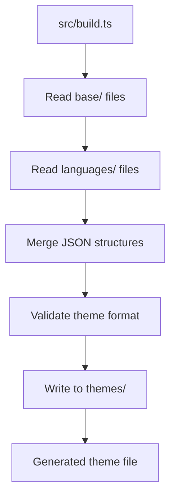

# Architecture Guide

## Overview

This document explains the architecture and design decisions behind the Material Theme for VS Code modular build system.

## 🏗️ Architecture Principles

### 1. Modularity
- **Separation of Concerns**: Base theme elements separated from language-specific rules
- **Maintainability**: Each language has its own file for easy updates
- **Reusability**: Common patterns can be shared across languages

### 2. Zero Dependencies
- **Security**: No external npm packages to manage or audit
- **Simplicity**: Uses Node.js/Deno built-in capabilities only
- **Performance**: Minimal build overhead

### 3. Type Safety
- **TypeScript**: Build script uses TypeScript for better developer experience
- **Runtime Agnostic**: Works with both Node.js 22+ and Deno
- **Interface Contracts**: Clear type definitions for theme structure

## 📁 Directory Structure

```
src/
├── base/                   # Foundation files
│   ├── colors.json         # UI colors and workbench theming
│   └── general.json        # General syntax highlighting rules
├── languages/              # Language-specific files
│   ├── csharp.json         # C# specific rules
│   ├── javascript.json     # JavaScript/TypeScript rules
│   ├── markup-data.json    # HTML, CSS, JSON, YAML, Markdown
│   ├── php.json            # PHP specific rules
│   ├── python.json         # Python specific rules
│   ├── shell.json          # Shell/Bash specific rules
│   └── terraform.json      # Terraform/HCL specific rules
└── build.ts                # TypeScript build script
```

## 🔧 Build System

### Build Process Flow



### Build Script Design

The build script (`src/build.ts`) follows these patterns:

1. **Type-First Approach**
   ```typescript
   type ThemeData = {
     colors?: Record<string, string>;
     tokenColors?: TokenColor[];
   };
   ```

2. **Functional Programming**
   - Pure functions for JSON processing
   - Immutable data transformations
   - Error handling with proper types

3. **File System Abstraction**
   ```typescript
   const readJsonFile = async (filePath: string): Promise<ThemeData> => {
     // Safe JSON reading with error handling
   };
   ```

## 🎨 Theme Structure

### Base Layer (`src/base/`)

#### colors.json
Defines VS Code workbench colors following Material Design principles:
- **Surface Colors**: Editor background, sidebar, panels
- **Primary Colors**: Accent colors, highlights
- **Semantic Colors**: Error, warning, info, success

#### general.json
Contains universal syntax highlighting rules:
- **Comments**: Consistent across all languages
- **Strings**: Base string styling
- **Numbers**: Numeric values styling
- **Keywords**: Language-agnostic keywords

### Language Layer (`src/languages/`)

Each language file extends the base theme with specific rules:

#### Structure Pattern
```json
{
  "tokenColors": [
    {
      "name": "Language - Feature Description",
      "scope": ["source.language.feature"],
      "settings": {
        "foreground": "#COLOR",
        "fontStyle": "style"
      }
    }
  ]
}
```

#### Naming Convention
- **File Names**: `language.json` (e.g., `python.json`)
- **Rule Names**: `Language - Feature` (e.g., `Python - Function Definition`)
- **Scopes**: Follow TextMate grammar conventions

## 🎯 Design Patterns

### 1. Theme Composition Pattern
```typescript
// Base theme provides foundation
const baseTheme = await readBaseTheme();

// Language files extend with specific rules
const languageRules = await readLanguageFiles();

// Final theme is composition of all parts
const finalTheme = composeTheme(baseTheme, languageRules);
```

### 2. Scope Hierarchy Pattern
```
source.language                // Language root
├── source.language.keyword    // Language keywords
├── source.language.string     // String literals
└── source.language.comment    // Comments
```

### 3. Color Inheritance Pattern
```json
{
  "colors": {
    "editor.background": "#263238",         // Base color
    "editorGroup.background": "#263238",    // Inherits from base
    "panel.background": "#263238"           // Consistent theming
  }
}
```

## 🔍 Language Integration

### Adding New Language Support

1. **Research TextMate Grammar**
   - Find the language's grammar scopes
   - Understand scope hierarchy
   - Identify unique language features

2. **Create Language File**
   ```bash
   touch src/languages/new-language.json
   ```

3. **Define Token Rules**
   ```json
   {
     "tokenColors": [
       {
         "name": "NewLanguage - Keywords",
         "scope": ["keyword.control.newlang"],
         "settings": {
           "foreground": "#C792EA"
         }
       }
     ]
   }
   ```

4. **Test and Validate**
   - Build theme
   - Test with real code files
   - Verify color consistency

### Scope Resolution Order

The VS Code theme engine processes rules in order:
1. **More Specific Scopes** win over general ones
2. **Later Rules** override earlier ones for same scope
3. **Exact Matches** take precedence over partial matches

## 🧪 Testing Strategy

### Build Validation
```typescript
// Validate theme structure
const isValidTheme = (theme: Theme): boolean => {
  return theme.colors && theme.tokenColors && theme.name;
};
```

### Color Consistency
- All colors follow Material Design palette
- Contrast ratios meet accessibility standards
- Colors are consistent across languages

### Scope Coverage
- Test files for each supported language
- Edge cases and complex syntax
- Integration with VS Code extensions

## 🚀 Performance Considerations

### Build Performance
- **Async Operations**: Parallel file reading
- **Minimal Processing**: Direct JSON merging
- **No Dependencies**: Fast startup time

### Runtime Performance
- **Optimized Rules**: Specific scopes reduce matching overhead
- **Minimal Duplication**: Rules are deduplicated during build
- **Efficient Structure**: VS Code optimized theme format

## 🔒 Security Model

### Build Security
- **No External Dependencies**: Eliminates supply chain attacks
- **Type Safety**: Prevents runtime errors
- **Input Validation**: JSON schema validation

### Development Security
- **Signed Commits**: All commits must be signed
- **CI/CD Pipeline**: Automated security checks
- **Dependency Scanning**: Regular security audits

## 🔄 Future Architecture Plans

### Planned Improvements
1. **Schema Validation**: JSON schema for theme files
2. **Plugin System**: Support for custom language extensions
3. **Theme Variants**: Light/dark mode variations
4. **Performance Metrics**: Build and runtime performance tracking

### Migration Strategy
- Backward compatibility maintained
- Gradual feature rollout
- Community feedback integration

This architecture provides a solid foundation for maintaining and extending the Material Theme while keeping the codebase clean, secure, and performant.
